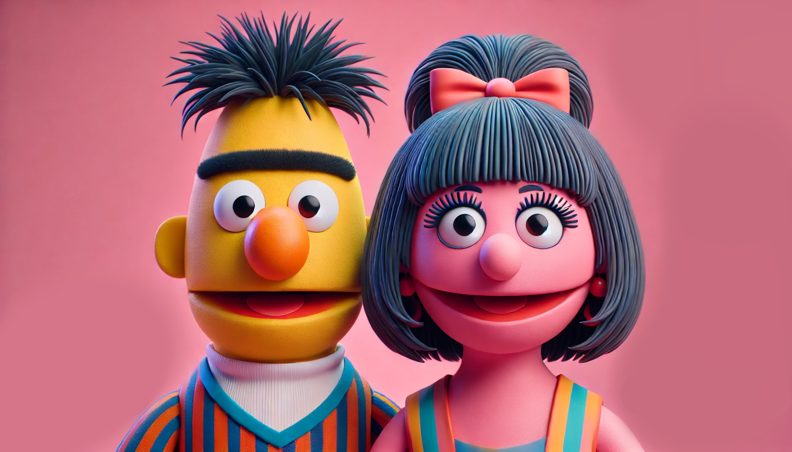

<div style={{ textAlign: 'center', fontSize: '12px', marginTop: '-20px' }}>
  Figure 1: *Illustration generated using GPT-4o*
</div>

### Introduction
Both BERT<sup>[1]</sup> and RoBERTa<sup>[2]</sup> are encoder-only transformer models that transform an input sequence into a set of continuous representations (vectors) to capture the information and context of the input. These models can be applied to tasks listed below, by adding a classification layer on top.

<ol style={{ marginTop: '-15px' }}>
  <li>
    <strong>1. Text Classification:</strong> 
    <div style={{ marginLeft: '20px', marginTop: '5px' }}>
      Example: <em>Sentiment Analysis</em> - Determining whether a review is positive, negative, or neutral.
    </div>
  </li>
  <li style={{ marginTop: '-30px' }}>
    <strong>2. Token Classification:</strong> 
    <div style={{ marginLeft: '20px', marginTop: '5px' }}>
      Example: <em>Named Entity Recognition (NER)</em> - Identifying and classifying each token in a sentence, such as names of people, organizations, or locations.
    </div>
  </li>
  <li style={{ marginTop: '-30px' }}>
    <strong>3. Masked Word Prediction:</strong> 
    <div style={{ marginLeft: '20px', marginTop: '5px' }}>
      Example: <em>Text Completion</em> - Predicting missing words in a sentence like "Pair the [MASK] with spicy ramen and chilli oil."
    </div>
  </li>
</ol>

### Model Architecture

<div style={{ textAlign: 'center', fontSize: '12px', marginTop: '-20px' }}>
  Figure 2: *The architecture of encoder-only model*
</div>
The first image in Figure 2 presents the encoder only architecture with one encoder block. The second image presents the BERT and RoBERTa architecture with multiple encoder blocks stacked on top of each other.

#### 1. Input Embeddings
Input embeddings are composed of three embeddings in BERT or two embeddings in RoBERTa:
<div style={{ textAlign: 'center', fontSize: '14px', marginTop: '-20px' }}>
  <code>Input Embeddings = Token + Positional + Segment Embeddings</code>
</div>
In RoBERTa, Segment Embeddings are omitted, as RoBERTa does not use the Next Sentence Prediction task and treats the entire input as a single sequence.

#### a. Token Embeddings
Each word in the input sequence is first converted into tokens. BERT and RoBERTa use a WordPiece<sup>[3]</sup> tokenizer, which splits words into subwords or characters. Figure 3 shows the conversion of word "Dumplings" into tokens.

<div style={{ display: 'flex', justifyContent: 'center', alignItems: 'center', marginTop: '0px' }}>
  <span style={{ fontWeight: 'bold', marginRight: '10px' }}>Dumplings</span>
  <span style={{ fontSize: '24px' }}>&#x27A1;</span>
  <div style={{ display: 'flex', alignItems: 'center', marginLeft: '10px' }}>
    <span style={{ color: 'black', backgroundColor: '#FECB6F', padding: '5px 5px', borderRadius: '5px', marginRight: '5px', fontSize: '12px' }}>Dump</span>
    <span style={{ color: 'black', backgroundColor: '#FECB6F', padding: '5px 5px', borderRadius: '5px', marginRight: '5px', fontSize: '12px' }}>##lings</span>
  </div>
</div>
<p style={{ textAlign: 'center', marginTop: '5px', fontSize: '12px', marginBottom: '-10px' }}>Figure 3: <em>Conversion of word to tokens. ## indicates that the token is a continuation of the previous token</em></p>

In addition to word and subword tokens, there are special tokens like:

<div style={{ display: 'flex', alignItems: 'center', marginTop: '-20px' }}>
  <span style={{ color: 'black', backgroundColor: '#FFD1DC', padding: '2px', borderRadius: '5px', marginRight: '10px', width: '60px', textAlign: 'center', fontSize: '12px', flexShrink: 0 }}>[CLS]</span>
  <span style={{ fontSize: '14px' }}>Indicates the start of the sequence.</span>
</div>

<div style={{ display: 'flex', alignItems: 'center', marginTop: '10px' }}>
  <span style={{ color: 'black', backgroundColor: '#AEC6CF', padding: '2px', borderRadius: '5px', marginRight: '10px', width: '60px', textAlign: 'center', fontSize: '12px', flexShrink: 0 }}>[SEP]</span>
  <span style={{ fontSize: '14px' }}>Used to separate different segments in a sequence.</span>
</div>

<div style={{ display: 'flex', alignItems: 'center', marginTop: '10px' }}>
  <span style={{ color: 'black', backgroundColor: '#FFB347', padding: '2px', borderRadius: '5px', marginRight: '10px', width: '60px', textAlign: 'center', fontSize: '12px', flexShrink: 0 }}>[MASK]</span>
  <span style={{ fontSize: '14px' }}>Represents masked tokens that the model attempts to predict.</span>
</div>

<div style={{ display: 'flex', alignItems: 'center', marginTop: '10px', marginBottom: '15px' }}>
  <span style={{ color: 'black', backgroundColor: '#CFCFC4', padding: '2px', borderRadius: '5px', marginRight: '10px', width: '60px', textAlign: 'center', fontSize: '12px', flexShrink: 0 }}>[PAD]</span>
  <span style={{ fontSize: '14px' }}>Used for padding multiple sequences to the same length.</span>
</div>

This vocabulary for the model is created by tokenizing the training dataset, where tokens are ranked by their frequency in the corpus—more common tokens are assigned lower integer identifier ID numbers, while less common tokens receive higher ID numbers. Figure 4 shows the `vocabulary.json` file for the model.
```python
{
  ...
  "##lings": 11227,
  ...
  "Dump": 15653,
  ...
}
```
<p style={{ textAlign: 'center', marginTop: '5px', fontSize: '12px', marginBottom: '-10px' }}>Figure 4: <em>vocabulary.json file. It contains the mapping of tokens to IDs</em></p>

After tokenizing the input text, each token is given a ID that was assgined to it while creating the vocabulary. Figure 5 shows the conversion of tokens to the corresponding IDs.
<div style={{ display: 'flex', justifyContent: 'center', alignItems: 'center', marginTop: '0px' }}>
  <div style={{ display: 'flex', alignItems: 'center', marginLeft: '10px' }}>
    <span style={{ color: 'black', backgroundColor: '#FECB6F', padding: '5px 5px', borderRadius: '5px', marginRight: '5px', fontSize: '12px' }}>Dump</span>
    <span style={{ color: 'black', backgroundColor: '#FECB6F', padding: '5px 5px', borderRadius: '5px', marginRight: '5px', fontSize: '12px' }}>##lings</span>
  </div>
  <span style={{ fontSize: '24px' }}>&#x27A1;</span>
  <div style={{ display: 'flex', alignItems: 'center', marginLeft: '10px' }}>
    <span style={{ color: 'black', backgroundColor: '#FFB0C1', padding: '5px 5px', borderRadius: '5px', marginRight: '5px', fontSize: '12px' }}>15653</span>
    <span style={{ color: 'black', backgroundColor: '#FFB0C1', padding: '5px 5px', borderRadius: '5px', marginRight: '5px', fontSize: '12px' }}>11227</span>
  </div>
</div>
<p style={{ textAlign: 'center', marginTop: '5px', fontSize: '12px', marginBottom: '-10px' }}>Figure 4: <em>Conversion of tokens to IDs</em></p>

These token IDs are then used to look up corresponding vectors in a large matrix called the embedding matrix. The embedding matrix is a learned parameter of the model and is initialized randomly before training. If the model’s dimensionality is `h` (the size of the embeddings vector), and the vocabulary size is `n`, the embeddings matrix will have dimensions `(n x h)`. Each row in this matrix corresponds to the embedding vector of a specific token ID. For each token ID, the corresponding row from the embedding matrix is retrieved. Matrix 1 is an example of the embeddings matrix.

<div style={{ display: 'flex', justifyContent: 'center', alignItems: 'center', marginTop: '0px' }}>
  <table style={{ borderCollapse: 'collapse', fontSize: '12px', textAlign: 'center' }}>
    <thead>
      <tr>
        <th style={{ border: '1px solid white', padding: '8px' }}>Token ID</th>
        <th style={{ border: '1px solid white', padding: '8px' }}>Dimension<sub>1</sub></th>
        <th style={{ border: '1px solid white', padding: '8px' }}>Dimension<sub>2</sub></th>
        <th style={{ border: '1px solid white', padding: '8px' }}>...</th>
        <th style={{ border: '1px solid white', padding: '8px' }}>Dimension<sub>h</sub></th>
      </tr>
    </thead>
    <tbody>
      <tr>
        <td style={{ border: '1px solid white', padding: '8px' }}>...</td>
        <td style={{ border: '1px solid white', padding: '8px' }}>...</td>
        <td style={{ border: '1px solid white', padding: '8px' }}>...</td>
        <td style={{ border: '1px solid white', padding: '8px' }}>...</td>
        <td style={{ border: '1px solid white', padding: '8px' }}>...</td>
      </tr>
      <tr>
        <td style={{ border: '1px solid white', padding: '8px' }}>11227 (Dump)</td>
        <td style={{ border: '1px solid white', padding: '8px' }}>0.025</td>
        <td style={{ border: '1px solid white', padding: '8px' }}>-0.034</td>
        <td style={{ border: '1px solid white', padding: '8px' }}>...</td>
        <td style={{ border: '1px solid white', padding: '8px' }}>0.112</td>
      </tr>
      <tr>
        <td style={{ border: '1px solid white', padding: '8px' }}>...</td>
        <td style={{ border: '1px solid white', padding: '8px' }}>...</td>
        <td style={{ border: '1px solid white', padding: '8px' }}>...</td>
        <td style={{ border: '1px solid white', padding: '8px' }}>...</td>
        <td style={{ border: '1px solid white', padding: '8px' }}>...</td>
      </tr>
      <tr>
        <td style={{ border: '1px solid white', padding: '8px' }}>15653 (##lings)</td>
        <td style={{ border: '1px solid white', padding: '8px' }}>-0.045</td>
        <td style={{ border: '1px solid white', padding: '8px' }}>0.081</td>
        <td style={{ border: '1px solid white', padding: '8px' }}>...</td>
        <td style={{ border: '1px solid white', padding: '8px' }}>0.067</td>
      </tr>
      <tr>
        <td style={{ border: '1px solid white', padding: '8px' }}>...</td>
        <td style={{ border: '1px solid white', padding: '8px' }}>...</td>
        <td style={{ border: '1px solid white', padding: '8px' }}>...</td>
        <td style={{ border: '1px solid white', padding: '8px' }}>...</td>
        <td style={{ border: '1px solid white', padding: '8px' }}>...</td>
      </tr>
      <tr>
        <td style={{ border: '1px solid white', padding: '8px' }}>Token ID<sub>n</sub></td>
        <td style={{ border: '1px solid white', padding: '8px' }}>...</td>
        <td style={{ border: '1px solid white', padding: '8px' }}>...</td>
        <td style={{ border: '1px solid white', padding: '8px' }}>...</td>
        <td style={{ border: '1px solid white', padding: '8px' }}>...</td>
      </tr>
    </tbody>
  </table>
</div>
<p style={{ textAlign: 'center', marginTop: '2px', fontSize: '12px', marginBottom: '-10px' }}>Matrix 1: <em>Embeddings matrix. These values are random and not the actual values</em></p>

#### b. Positional Embeddings
The positional embeddings are learnable parameters, just like the token embeddings. During model initialization, the positional embedding vectors are initialized with random values. For example, if the model is designed to handle sequences of up to 512 tokens, there will be 512 positional embedding vectors, one for each possible position in the input sequence. Since Transformers do not have a built-in notion of sequence order, positional embeddings are added to the token embeddings. These embeddings encode the position of each token in the sequence, allowing the model to understand the order of words. In the case of Dumplings, 1st postition vector will be added the the input embedding of "Dump" and 2nd position vector will be added to the input embedding of "##lings". These embeddings ensure the model understands the sequential nature of the data, which is critical for capturing context.

#### c. Segment Embeddings
BERT is designed to handle pairs of sentences (like in tasks such as Question Answering or Next Sentence Prediction). To distinguish between the two sentences, BERT adds segment embeddings (a learned parameter), where each token is assigned an embedding indicating whether it belongs to the first or the second sentence.  RoBERTa does not use segment embeddings because it is not trained with the Next Sentence Prediction task.

#### 3. Encoder Block
#### a. Multi-Head Attention
Multi-head attention, enables the model to attend to different parts of the sequence simultaneously. This mechanism helps the model capture complex relationships between words, regardless of their distance in the sequence.

After adding the Token Embeddings, Positional Embeddings and Segment Embeddings (in case of BERT), we'll get Input Embeddings <code>X<sub>embed</sub></code> of shape `(s, h)` where `s` is the input sequence length (number of input tokens) and `h` is the model's dimensionality (embedding vector size). Therefore in case of input "Dumplings are tasty" our matrix <code>X<sub>embed</sub></code> would be as shown in Matrix 2.
<div style={{ display: 'flex', justifyContent: 'center', alignItems: 'center', marginTop: '-10px' }}>
  <table style={{ borderCollapse: 'collapse', fontSize: '12px', textAlign: 'center' }}>
    <tbody>
      <tr>
        <td style={{ border: '1px solid white', padding: '8px' }}>Dump</td>
        <td style={{ border: '1px solid white', padding: '8px' }}>e<sub>11</sub></td>
        <td style={{ border: '1px solid white', padding: '8px' }}>e<sub>12</sub></td>
        <td style={{ border: '1px solid white', padding: '8px' }}>...</td>
        <td style={{ border: '1px solid white', padding: '8px' }}>e<sub>1h</sub></td>
      </tr>
      <tr>
        <td style={{ border: '1px solid white', padding: '8px' }}>##lings</td>
        <td style={{ border: '1px solid white', padding: '8px' }}>e<sub>21</sub></td>
        <td style={{ border: '1px solid white', padding: '8px' }}>e<sub>22</sub></td>
        <td style={{ border: '1px solid white', padding: '8px' }}>...</td>
        <td style={{ border: '1px solid white', padding: '8px' }}>e<sub>2h</sub></td>
      </tr>
      <tr>
        <td style={{ border: '1px solid white', padding: '8px' }}>are</td>
        <td style={{ border: '1px solid white', padding: '8px' }}>e<sub>31</sub></td>
        <td style={{ border: '1px solid white', padding: '8px' }}>e<sub>32</sub></td>
        <td style={{ border: '1px solid white', padding: '8px' }}>...</td>
        <td style={{ border: '1px solid white', padding: '8px' }}>e<sub>3h</sub></td>
      </tr>
      <tr>
        <td style={{ border: '1px solid white', padding: '8px' }}>ta</td>
        <td style={{ border: '1px solid white', padding: '8px' }}>e<sub>41</sub></td>
        <td style={{ border: '1px solid white', padding: '8px' }}>e<sub>42</sub></td>
        <td style={{ border: '1px solid white', padding: '8px' }}>...</td>
        <td style={{ border: '1px solid white', padding: '8px' }}>e<sub>4h</sub></td>
      </tr>
      <tr>
        <td style={{ border: '1px solid white', padding: '8px' }}>##sty</td>
        <td style={{ border: '1px solid white', padding: '8px' }}>e<sub>51</sub></td>
        <td style={{ border: '1px solid white', padding: '8px' }}>e<sub>52</sub></td>
        <td style={{ border: '1px solid white', padding: '8px' }}>...</td>
        <td style={{ border: '1px solid white', padding: '8px' }}>e<sub>5h</sub></td>
      </tr>
    </tbody>
  </table>
</div>
<p style={{ textAlign: 'center', marginTop: '10px', lineHeight: '15px', fontSize: '12px', marginBottom: '-10px' }}>
  <span>Matrix 2: </span><em>Embedding Matrix <code>X<sub>embed</sub></code>.</em>
</p>

BERT and RoBERTa have `n` attention heads and for each *ith* head the input embedding <code>X<sub>embed</sub></code> is linearly transformed into three different matrices: <code>Query Q<sub>i</sub></code>, <code>Key K<sub>i</sub></code>, and <code>Value V<sub>i</sub></code>. This is done by multiplying <code>X<sub>embed</sub></code> by three different weight matrices: <code>W<sub>Q<sub>i</sub></sub></code>, <code>W<sub>K<sub>i</sub></sub></code>, and <code>W<sub>V<sub>i</sub></sub></code>. The shape of these weight matrices is <code>(h, h<sub>head</sub>)</code>, where <code>h<sub>head</sub> = h/n</code>. The resulting <code>Q<sub>i</sub></code>, <code>K<sub>i</sub></code>, and <code>V<sub>i</sub></code> matrices have the shape <code>(s, h<sub>head</sub>)</code>.
<div style={{ marginTop: '-15px', marginBottom: '15px', display: 'flex', justifyContent: 'center', alignItems: 'center' }}>
  <code style={{ marginRight: '30px' }} >Q<sub>i</sub> = X<sub>embed</sub> × W<sub>Q<sub>i</sub></sub></code>
  <code style={{ marginRight: '30px' }} >K<sub>i</sub> = X<sub>embed</sub> × W<sub>K<sub>i</sub></sub></code>
  <code>V<sub>i</sub> = X<sub>embed</sub> × W<sub>V<sub>i</sub></sub></code>
</div>

<div style={{ marginBottom: '-25px' }}>
  <span>
    After this, the attention scores are calculated by multiplying the Query matrix 
    <code>Q<sub>i</sub></code> with the transpose of Key matrix <code>K<sub>i</sub><sup>T</sup></code>. 
    The result of dot products is an attention score (similarity) matrix <code>S<sub>i</sub></code> with a shape of 
    <code>(s, s)</code> that indicates the similarity between each token. 
    This shows how much each token (represented by a query) "attends" to every other token 
    (represented by a key). The attention scores are divided by the square root of <code>h<sub>head</sub></code> (to prevent the scores from becoming too large as the dimension increases) 
    and then the scaled attention scores are passed through a softmax function to obtain the attention weights. 
    The attention weights matrix <code>S<sub>i</sub></code> is shown in Matrix 3 and <code>s21</code> gives the importance of "Dump" while processing "##lings".
  </span>
</div>

<div style={{ display: 'flex', justifyContent: 'center', alignItems: 'center', marginTop: '10px', marginBottom: '20px' }}>
  <div style={{ display: 'flex', flexDirection: 'column', alignItems: 'center' }}>
    <table style={{ borderCollapse: 'collapse', fontSize: '12px', textAlign: 'center' }}>
      <tbody>
        <tr>
          <td style={{ border: '1px solid white', padding: '8px' }}></td>
          <td style={{ border: '1px solid white', padding: '8px' }}>Dump</td>
          <td style={{ border: '1px solid white', padding: '8px' }}>##lings</td>
          <td style={{ border: '1px solid white', padding: '8px' }}>are</td>
          <td style={{ border: '1px solid white', padding: '8px' }}>ta</td>
          <td style={{ border: '1px solid white', padding: '8px' }}>##sty</td>
        </tr>
        <tr>
          <td style={{ border: '1px solid white', padding: '8px' }}>Dump</td>
          <td style={{ border: '1px solid white', padding: '8px' }}>s<sub>11</sub></td>
          <td style={{ border: '1px solid white', padding: '8px' }}>s<sub>12</sub></td>
          <td style={{ border: '1px solid white', padding: '8px' }}>s<sub>13</sub></td>
          <td style={{ border: '1px solid white', padding: '8px' }}>s<sub>14</sub></td>
          <td style={{ border: '1px solid white', padding: '8px' }}>s<sub>15</sub></td>
        </tr>
        <tr>
          <td style={{ border: '1px solid white', padding: '8px' }}>##lings</td>
          <td style={{ border: '1px solid white', padding: '8px' }}>s<sub>21</sub></td>
          <td style={{ border: '1px solid white', padding: '8px' }}>s<sub>22</sub></td>
          <td style={{ border: '1px solid white', padding: '8px' }}>s<sub>23</sub></td>
          <td style={{ border: '1px solid white', padding: '8px' }}>s<sub>24</sub></td>
          <td style={{ border: '1px solid white', padding: '8px' }}>s<sub>25</sub></td>
        </tr>
        <tr>
          <td style={{ border: '1px solid white', padding: '8px' }}>are</td>
          <td style={{ border: '1px solid white', padding: '8px' }}>s<sub>31</sub></td>
          <td style={{ border: '1px solid white', padding: '8px' }}>s<sub>32</sub></td>
          <td style={{ border: '1px solid white', padding: '8px' }}>s<sub>33</sub></td>
          <td style={{ border: '1px solid white', padding: '8px' }}>s<sub>34</sub></td>
          <td style={{ border: '1px solid white', padding: '8px' }}>s<sub>35</sub></td>
        </tr>
        <tr>
          <td style={{ border: '1px solid white', padding: '8px' }}>ta</td>
          <td style={{ border: '1px solid white', padding: '8px' }}>s<sub>41</sub></td>
          <td style={{ border: '1px solid white', padding: '8px' }}>s<sub>42</sub></td>
          <td style={{ border: '1px solid white', padding: '8px' }}>s<sub>43</sub></td>
          <td style={{ border: '1px solid white', padding: '8px' }}>s<sub>44</sub></td>
          <td style={{ border: '1px solid white', padding: '8px' }}>s<sub>45</sub></td>
        </tr>
        <tr>
          <td style={{ border: '1px solid white', padding: '8px' }}>##sty</td>
          <td style={{ border: '1px solid white', padding: '8px' }}>s<sub>51</sub></td>
          <td style={{ border: '1px solid white', padding: '8px' }}>s<sub>52</sub></td>
          <td style={{ border: '1px solid white', padding: '8px' }}>s<sub>53</sub></td>
          <td style={{ border: '1px solid white', padding: '8px' }}>s<sub>54</sub></td>
          <td style={{ border: '1px solid white', padding: '8px' }}>s<sub>55</sub></td>
        </tr>
      </tbody>
    </table>
    <div style={{ textAlign: 'center', marginTop: '10px', lineHeight: '15px', fontSize: '11px' }}>
      <span>Matrix 3: </span>
      <em>Attention Weight Matrix <code>S<sub>i</sub></code> with the shape `(s, s)`: Softmax</em>
      <span style={{ display: 'inline-flex', alignItems: 'center' }}>
        <span style={{ marginLeft: '2px', marginRight: '2px' }}>(</span>
        <span style={{ display: 'inline-block', textAlign: 'center' }}>
          <span style={{ borderBottom: '1px solid', display: 'block' }}>Q × K<sup>T</sup></span>
          <span>&radic;h</span>
        </span>
        <span style={{ marginLeft: '2px', marginRight: '2px' }}>)</span>
      </span>
    </div>
  </div>
</div>


After we have the attention weight matrix <code>S<sub>i</sub></code>, we calcuate the output of the attention head using the equation <code>A<sub>i</sub> = S<sub>i</sub> x V<sub>i</sub></code> for the *ith* head. We get <code>A<sub>i</sub></code> of shape <code>(s, h<sub>head</sub>)</code> and it is a context-aware representations for each token in the sequence, allowing the model to focus on the most important parts of the input when generating its final output.

<div>
  <span>
    In multi-head attention, this process is repeated for several heads (each with different 
    weight matrices). This allows the model to focus on different parts of the sequence. The output matrix 
    <code>A<sub>i</sub></code> from each head is concatenated to get the final output <code>A<sub>atten</sub> = [A<sub>1</sub>; A<sub>2</sub>; ..., A<sub>i</sub>]</code> of multi-head attention. After concatenation, the shape of <code>A<sub>atten</sub></code> will be <code>(s, n<sub>head</sub>xh<sub>head</sub>) = (s, h)</code>.
  </span>
</div>

#### d. Add & Norm
The output of the multi-head attention <code>A<sub>atten</sub></code> is added to the original input <code>X<sub>embed</sub></code>. This residual connection helps to mitigate the vanishing gradient problem by allowing gradients to flow directly through the network, making it easier to train deep networks. The residual connection also helps in preserving the original information from the input. After adding the residual connection, the result is passed through a layer normalization step. Layer normalization stabilizes the training by normalizing the output of Add step to have a mean of 0 and a standard deviation of 1 across the hidden dimension. The output of this layer is denoted by <code>X<sub>norm</sub></code> and it's shape is `(s, h)`.
<p style={{ textAlign: 'center', marginTop: '-10px', lineHeight: '15px', fontSize: '14px', marginBottom: '-10px' }}>
  <span><code>X<sub>norm<sub>1</sub></sub> = LayerNorm(X<sub>embed</sub> + A<sub>atten</sub>)</code></span>
</p>

#### c. Feed Forward Layer
Both BERT and RoBERTa have two feed forward layers. The first feed forward layer projects <code>X<sub>norm<sub>1</sub></sub></code> from size `(s, h)` to <code>(s, h<sub>ff</sub>)</code> where <code>h<sub>ff</sub></code> is greater than `h`. The second feed forward layer projects the output of the first layer back to `(s, h)`. The output of the feed forward layers is denoted as <code>O<sub>ff<sub></sub></sub></code> and is passed into the second Add & Norm part of the encoder block. The output of the second Add & Norm is denoted by <code>X<sub>norm<sub>2</sub><sub></sub></sub></code> and it's shape is `(s, h)`.
<p style={{ textAlign: 'center', marginTop: '-10px', lineHeight: '15px', fontSize: '14px', marginBottom: '-10px' }}>
  <span><code>X<sub>norm<sub>2</sub></sub> = LayerNorm(X<sub>norm<sub>1</sub></sub> + O<sub>ff</sub>)</code></span>
</p>

The output of the encoder block <code>X<sub>norm<sub>2</sub></sub></code> is passed to the next encoder block. And the <code>X<sub>norm</sub></code> from the final encoder block can be passed to a feed forward classifier layer for prediction.

### BERT vs. RoBERTa
BERT is trained on BookCorpus<sup>[4]</sup> and English Wikipedia<sup>[5]</sup>, while RoBERTa is trained on a larger dataset, including BookCorpus, English Wikipedia, CC-News<sup>[6]</sup>, OpenWebText<sup>[7]</sup>, and Stories. BERT is trained using the Masked Language Model and Next Sentence Prediction tasks, but RoBERTa removed the Next Sentence Prediction task because not using it did not degrade the model's performance. In BERT training, static masking is used (the same tokens are masked in every epoch), while RoBERTa uses dynamic masking (different tokens are masked across epochs). BERT is trained for fewer steps with smaller batch sizes, whereas RoBERTa is trained for longer with larger batch sizes and higher learning rates.

### References
<div style={{ fontSize: '14px', marginTop: '-10px' }}>
  [1] <a href="https://aclanthology.org/N19-1423/" target="_blank">BERT: Pre-training of Deep Bidirectional Transformers for Language Understanding</a>
</div>
<div style={{ fontSize: '14px', marginTop: '-10px' }}>
  [2] <a href="https://arxiv.org/abs/1907.11692" target="_blank">RoBERTa: A Robustly Optimized BERT Pretraining Approach</a>
</div>
<div style={{ fontSize: '14px', marginTop: '-10px' }}>
  [3] <a href="https://aclanthology.org/2021.emnlp-main.160/" target="_blank">Fast WordPiece Tokenization</a>
</div>
<div style={{ fontSize: '14px', marginTop: '-10px' }}>
  [4] <a href="https://arxiv.org/abs/1506.06724" target="_blank">Aligning Books and Movies: Towards Story-like Visual Explanations by Watching Movies and Reading Books</a>
</div>
<div style={{ fontSize: '14px', marginTop: '-10px' }}>
  [5] <a href="https://www.wikipedia.org/" target="_blank">Wikipedia</a>
</div>
<div style={{ fontSize: '14px', marginTop: '-10px' }}>
  [6] <a href="https://commoncrawl.org/blog/news-dataset-available" target="_blank">Common Crawl New Dataset</a>
</div>
<div style={{ fontSize: '14px', marginTop: '-10px' }}>
  [7] <a href="https://github.com/jcpeterson/openwebtext?tab=readme-ov-file" target="_blank">OpenWebText Dataset</a>
</div>
