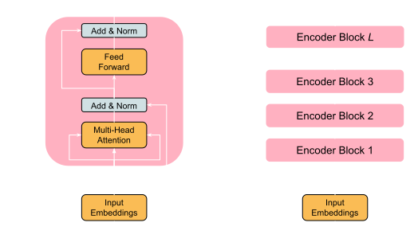

  *Illustration generated using GPT-4o*

### Introduction
Both BERT[1] and RoBERTa[2] are encoder-only transformer models that transform an input sequence into a set of continuous representations (vectors) to capture the information and context of the input. These models can be applied to tasks listed below, by adding a classification layer on top of the model.

<ol style={{ marginTop: '-15px' }}>
  <li>
    <strong>1. Text Classification:</strong> 
    

      Example: <em>Sentiment Analysis</em> - Determining whether a review is positive, negative, or neutral.
    

  </li>
  <li style={{ marginTop: '-30px' }}>
    <strong>2. Token Classification:</strong> 
    

      Example: <em>Named Entity Recognition (NER)</em> - Identifying and classifying each token in a sentence, such as names of people, organizations, or locations.
    

  </li>
  <li style={{ marginTop: '-30px' }}>
    <strong>3. Masked Word Prediction:</strong> 
    

      Example: <em>Text Completion</em> - Predicting missing words in a sentence like "Pair the [MASK] with spicy ramen and chilli oil."
    

  </li>
</ol>

### Model Architecture

#### 1. Input Embeddings
Each word in the input sequence is first converted into tokens. BERT and RoBERTa use a WordPiece[3] tokenizer, which splits words into subwords or characters for rare or out-of-vocabulary words.

  Dumplings
  &#x27A1;
  

    Dump
    ##lings
  

<em>The ## indicates that the token is a continuation of the previous token.</em>

In addition to word and subword tokens, the vocabulary includes special tokens like:

  [CLS]
  Indicates the start of the sequence.

  [SEP]
  Used to separate different segments in a sequence.

  [MASK]
  Represents masked tokens that the model attempts to predict.

  [PAD]
  Used for padding multiple sequences to the same length.

This vocabulary is created by tokenizing the pre-training dataset, where tokens are ranked by their frequency in the corpus—more common tokens are assigned lower integer identifier ID numbers, while less common tokens receive higher ID numbers. Once the input text is tokenized, each token is mapped to a unique ID based on a predefined vocabulary. 

  

    Dump
    ##lings
  

  &#x27A1;
  

    15653
    11227
  

<em>Each token has a unique ID.</em>

These token IDs are then used to look up corresponding vectors in a large matrix called the **embedding matrix**. The embedding matrix is a learned parameter of the model and is initialized randomly before training. If the model’s dimensionality is `h`, and the vocabulary size is `n`, the embedding matrix will have dimensions `(n x h)`. Each row in this matrix corresponds to the embedding of a particular token ID. For each token ID, the corresponding row from the embedding matrix is retrieved. 

  <table style={{ borderCollapse: 'collapse', fontSize: '12px', textAlign: 'center' }}>
    <thead>
      <tr>
        <th style={{ border: '1px solid white', padding: '8px' }}>Token</th>
        <th style={{ border: '1px solid white', padding: '8px' }}>Embedding Dimension 1</th>
        <th style={{ border: '1px solid white', padding: '8px' }}>Embedding Dimension 2</th>
        <th style={{ border: '1px solid white', padding: '8px' }}>...</th>
        <th style={{ border: '1px solid white', padding: '8px' }}>Embedding Dimension h</th>
      </tr>
    </thead>
    <tbody>
      <tr>
        <td style={{ border: '1px solid white', padding: '8px' }}>Dump</td>
        <td style={{ border: '1px solid white', padding: '8px' }}>0.025</td>
        <td style={{ border: '1px solid white', padding: '8px' }}>-0.034</td>
        <td style={{ border: '1px solid white', padding: '8px' }}>...</td>
        <td style={{ border: '1px solid white', padding: '8px' }}>0.112</td>
      </tr>
      <tr>
        <td style={{ border: '1px solid white', padding: '8px' }}>##lings</td>
        <td style={{ border: '1px solid white', padding: '8px' }}>-0.045</td>
        <td style={{ border: '1px solid white', padding: '8px' }}>0.081</td>
        <td style={{ border: '1px solid white', padding: '8px' }}>...</td>
        <td style={{ border: '1px solid white', padding: '8px' }}>0.067</td>
      </tr>
      <tr>
        <td style={{ border: '1px solid white', padding: '8px' }}>...</td>
        <td style={{ border: '1px solid white', padding: '8px' }}>...</td>
        <td style={{ border: '1px solid white', padding: '8px' }}>...</td>
        <td style={{ border: '1px solid white', padding: '8px' }}>...</td>
        <td style={{ border: '1px solid white', padding: '8px' }}>...</td>
      </tr>
      <tr>
        <td style={{ border: '1px solid white', padding: '8px' }}>Tokenn</td>
        <td style={{ border: '1px solid white', padding: '8px' }}>...</td>
        <td style={{ border: '1px solid white', padding: '8px' }}>...</td>
        <td style={{ border: '1px solid white', padding: '8px' }}>...</td>
        <td style={{ border: '1px solid white', padding: '8px' }}>...</td>
      </tr>
    </tbody>
  </table>

<em>These values are random and not the actual values.</em>

#### 2. Positional Embeddings
The positional embeddings are learnable parameters, just like the token embeddings. During the initialization phase of the model, the positional embedding vectors is initalized with random values. For example, if the model is designed to handle sequences of up to `s` tokens, there will be `s` positional embedding vectors, one for each possible position in the input sequence. Since Transformers do not have a built-in notion of sequence order, positional embeddings are added to the token embeddings. These embeddings encode the position of each token in the sequence, allowing the model to understand the order of words. In the case of Dumplings, 1st postition vector will be added the the input embedding of "Dump" and 2nd position vector will be added to the input embedding of "##lings".

#### 3. Encoder Block
#### a. Multi-Head Attention
Multi-head attention, allows the model to focus on different parts of the sequence simultaneously. This mechanism helps the model capture complex relationships between words, regardless of their distance in the sequence.

After adding the Input Embeddings and Positional Embeddings, we'll get final embeddings `X`. Therefore our matrix `X` would be:

  <table style={{ borderCollapse: 'collapse', fontSize: '12px', textAlign: 'center' }}>
    <tbody>
      <tr>
        <td style={{ border: '1px solid white', padding: '8px' }}>Dump</td>
        <td style={{ border: '1px solid white', padding: '8px' }}>e11</td>
        <td style={{ border: '1px solid white', padding: '8px' }}>e12</td>
        <td style={{ border: '1px solid white', padding: '8px' }}>...</td>
        <td style={{ border: '1px solid white', padding: '8px' }}>e1k</td>
      </tr>
      <tr>
        <td style={{ border: '1px solid white', padding: '8px' }}>##lings</td>
        <td style={{ border: '1px solid white', padding: '8px' }}>e21</td>
        <td style={{ border: '1px solid white', padding: '8px' }}>e22</td>
        <td style={{ border: '1px solid white', padding: '8px' }}>...</td>
        <td style={{ border: '1px solid white', padding: '8px' }}>e2k</td>
      </tr>
      <tr>
        <td style={{ border: '1px solid white', padding: '8px' }}>are</td>
        <td style={{ border: '1px solid white', padding: '8px' }}>e31</td>
        <td style={{ border: '1px solid white', padding: '8px' }}>e32</td>
        <td style={{ border: '1px solid white', padding: '8px' }}>...</td>
        <td style={{ border: '1px solid white', padding: '8px' }}>e3k</td>
      </tr>
      <tr>
        <td style={{ border: '1px solid white', padding: '8px' }}>ta</td>
        <td style={{ border: '1px solid white', padding: '8px' }}>e41</td>
        <td style={{ border: '1px solid white', padding: '8px' }}>e42</td>
        <td style={{ border: '1px solid white', padding: '8px' }}>...</td>
        <td style={{ border: '1px solid white', padding: '8px' }}>e4k</td>
      </tr>
      <tr>
        <td style={{ border: '1px solid white', padding: '8px' }}>##sty</td>
        <td style={{ border: '1px solid white', padding: '8px' }}>e51</td>
        <td style={{ border: '1px solid white', padding: '8px' }}>e52</td>
        <td style={{ border: '1px solid white', padding: '8px' }}>...</td>
        <td style={{ border: '1px solid white', padding: '8px' }}>e5k</td>
      </tr>
    </tbody>
  </table>

  <em>The shape of `X` is `(s, h)` where `h` is the model's dimensionality (embedding vector size) and `s` is the input sequence length (number of input tokens).</em>

  
    The input embedding <code>X</code> is linearly transformed into three different matrices: 
    <code>Query (Q)</code>, <code>Key (K)</code>, and <code>Value (V)</code>. This is done by 
    multiplying <code>X</code> by three different weight matrices: 
    <code>WQ</code>, <code>WK</code>, and <code>WV</code>. 
    The shape of these weight matrices is <code>(hhead, hhead)</code>, where <code>hhead = h/nheads</code>, and <code>nheads</code> is the number of attention heads. The resulting <code>Q</code>, <code>K</code>, and <code>V</code> matrices have the shape <code>(s, hhead)</code>.
  

  
    After this, the attention scores are calculated by multiplying the Query matrix 
    <code>Q</code> with the transpose of Key matrix <code>KT</code>. 
    The result of dot products is an attention score matrix with a shape of 
    <code>(s, s)</code> that indicates the similarity between each token. 
    This shows how much each token (represented by a query) "attends" to every other token 
    (represented by a key). The attention scores are divided by the square root of <code>hhead</code> (to prevent the scores from becoming too large as the dimension increases) 
    and then the scaled attention scores are passed through a softmax function to obtain the attention weights. 
    The attention weights below, <code>s21</code> gives the importance of "Dump" while processing "##lings".
  

  

    <table style={{ borderCollapse: 'collapse', fontSize: '12px', textAlign: 'center' }}>
      <tbody>
        <tr>
          <td style={{ border: '1px solid white', padding: '8px' }}></td>
          <td style={{ border: '1px solid white', padding: '8px' }}>Dump</td>
          <td style={{ border: '1px solid white', padding: '8px' }}>##lings</td>
          <td style={{ border: '1px solid white', padding: '8px' }}>are</td>
          <td style={{ border: '1px solid white', padding: '8px' }}>ta</td>
          <td style={{ border: '1px solid white', padding: '8px' }}>##sty</td>
        </tr>
        <tr>
          <td style={{ border: '1px solid white', padding: '8px' }}>Dump</td>
          <td style={{ border: '1px solid white', padding: '8px' }}>s11</td>
          <td style={{ border: '1px solid white', padding: '8px' }}>s12</td>
          <td style={{ border: '1px solid white', padding: '8px' }}>s13</td>
          <td style={{ border: '1px solid white', padding: '8px' }}>s14</td>
          <td style={{ border: '1px solid white', padding: '8px' }}>s15</td>
        </tr>
        <tr>
          <td style={{ border: '1px solid white', padding: '8px' }}>##lings</td>
          <td style={{ border: '1px solid white', padding: '8px' }}>s21</td>
          <td style={{ border: '1px solid white', padding: '8px' }}>s22</td>
          <td style={{ border: '1px solid white', padding: '8px' }}>s23</td>
          <td style={{ border: '1px solid white', padding: '8px' }}>s24</td>
          <td style={{ border: '1px solid white', padding: '8px' }}>s25</td>
        </tr>
        <tr>
          <td style={{ border: '1px solid white', padding: '8px' }}>are</td>
          <td style={{ border: '1px solid white', padding: '8px' }}>s31</td>
          <td style={{ border: '1px solid white', padding: '8px' }}>s32</td>
          <td style={{ border: '1px solid white', padding: '8px' }}>s33</td>
          <td style={{ border: '1px solid white', padding: '8px' }}>s34</td>
          <td style={{ border: '1px solid white', padding: '8px' }}>s35</td>
        </tr>
        <tr>
          <td style={{ border: '1px solid white', padding: '8px' }}>ta</td>
          <td style={{ border: '1px solid white', padding: '8px' }}>s41</td>
          <td style={{ border: '1px solid white', padding: '8px' }}>s42</td>
          <td style={{ border: '1px solid white', padding: '8px' }}>s43</td>
          <td style={{ border: '1px solid white', padding: '8px' }}>s44</td>
          <td style={{ border: '1px solid white', padding: '8px' }}>s45</td>
        </tr>
        <tr>
          <td style={{ border: '1px solid white', padding: '8px' }}>##sty</td>
          <td style={{ border: '1px solid white', padding: '8px' }}>s51</td>
          <td style={{ border: '1px solid white', padding: '8px' }}>s52</td>
          <td style={{ border: '1px solid white', padding: '8px' }}>s53</td>
          <td style={{ border: '1px solid white', padding: '8px' }}>s54</td>
          <td style={{ border: '1px solid white', padding: '8px' }}>s55</td>
        </tr>
      </tbody>
    </table>
    

      <em>Attention Weight Matrix `W` with the shape `(s, s)`: Softmax</em>
      
        (
        
          Q × KT
          &radic;h
        
        )
      
    

  

After we have the attention weight matrix `W`, we calcuate the output of the attention head using the equation `A = W x V`. We get `A` of shape <code>(s, hhead)</code> and it is a context-aware representations for each token in the sequence, allowing the model to focus on the most important parts of the input when generating its final output.

  
    In multi-head attention, this process is repeated for several heads (each with different 
    weight matrices <code>WQ</code>, <code>WK</code>, and <code>WV</code>). 
    This allows the model to focus on different parts of the sequence. The output matrices 
    <code>A</code> from each head are concatenated to get the final output <code>Aatten</code> of multi-head attention. After concatenation, the shape of <code>Aatten</code> will be <code>(s, nheadxhhead) = (s, h)</code>.
  

### References

  [1] <a href="https://aclanthology.org/N19-1423/" target="_blank">BERT: Pre-training of Deep Bidirectional Transformers for Language Understanding</a>

  [2] <a href="https://arxiv.org/abs/1907.11692" target="_blank">RoBERTa: A Robustly Optimized BERT Pretraining Approach</a>

  [3] <a href="https://aclanthology.org/2021.emnlp-main.160/" target="_blank">Fast WordPiece Tokenization</a>

