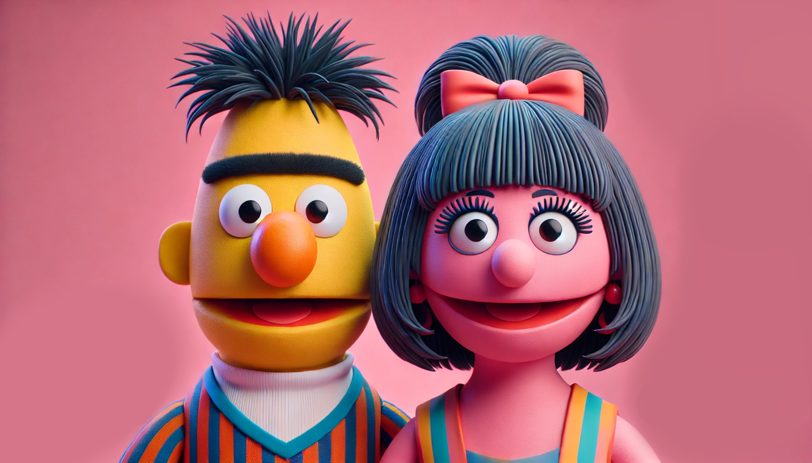
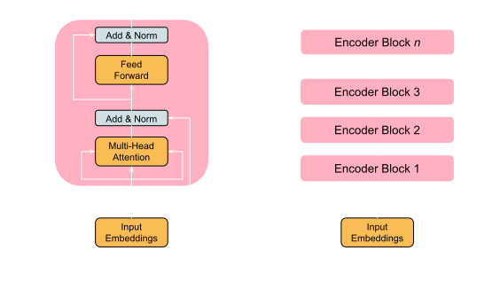

  *Illustration generated using GPT-4o*

### Introduction
Both BERT[1] and RoBERTa[2] are encoder-only transformer models that transform an input sequence into a set of continuous representations (vectors) to capture the information and context of the input. These models can be applied to tasks listed below, by adding a classification layer on top of the model.

<ol style={{ marginTop: '-15px' }}>
  <li>
    <strong>1. Text Classification:</strong> 
    

      Example: <em>Sentiment Analysis</em> - Determining whether a review is positive, negative, or neutral.
    

  </li>
  <li style={{ marginTop: '-30px' }}>
    <strong>2. Token Classification:</strong> 
    

      Example: <em>Named Entity Recognition (NER)</em> - Identifying and classifying each token in a sentence, such as names of people, organizations, or locations.
    

  </li>
  <li style={{ marginTop: '-30px' }}>
    <strong>3. Masked Word Prediction:</strong> 
    

      Example: <em>Text Completion</em> - Predicting missing words in a sentence like "Pair the [MASK] with spicy ramen and chilli oil."
    

  </li>
</ol>

### Model Architecture

#### 1. Input Embeddings
Each word in the input sequence is first converted into tokens. BERT and RoBERTa use a WordPiece[3] tokenizer, which splits words into subwords or characters for rare or out-of-vocabulary words.

  Dumplings
  &#x27A1;
  

    Dump
    ##lings
  

<em>The ## indicates that the token is a continuation of the previous token.</em>

In addition to word and subword tokens, the vocabulary includes special tokens like:

  [CLS]
  Indicates the start of the sequence.

  [SEP]
  Used to separate different segments in a sequence.

  [MASK]
  Represents masked tokens that the model attempts to predict.

  [PAD]
  Used for padding multiple sequences to the same length.

This vocabulary is created by tokenizing the pre-training dataset, where tokens are ranked by their frequency in the corpus—more common tokens are assigned lower integer identifier ID numbers, while less common tokens receive higher ID numbers. Once the input text is tokenized, each token is mapped to a unique ID based on a predefined vocabulary. 

  

    Dump
    ##lings
  

  &#x27A1;
  

    15653
    11227
  

<em>Each token has a unique ID.</em>

These token IDs are then used to look up corresponding vectors in a large matrix called the **embedding matrix**. The embedding matrix is a learned parameter of the model and is initialized randomly before training. If the model’s hidden size is *k*, and the vocabulary size is *n*, the embedding matrix will have dimensions *n* x *k*. Each row in this matrix corresponds to the embedding of a particular token ID. For each token ID, the corresponding row from the embedding matrix is retrieved. 

  <table style={{ borderCollapse: 'collapse', fontSize: '12px', textAlign: 'center' }}>
    <thead>
      <tr>
        <th style={{ border: '1px solid white', padding: '8px' }}>Token</th>
        <th style={{ border: '1px solid white', padding: '8px' }}>Embedding Dimension 1</th>
        <th style={{ border: '1px solid white', padding: '8px' }}>Embedding Dimension 2</th>
        <th style={{ border: '1px solid white', padding: '8px' }}>...</th>
        <th style={{ border: '1px solid white', padding: '8px' }}>Embedding Dimension k</th>
      </tr>
    </thead>
    <tbody>
      <tr>
        <td style={{ border: '1px solid white', padding: '8px' }}>Dump</td>
        <td style={{ border: '1px solid white', padding: '8px' }}>0.025</td>
        <td style={{ border: '1px solid white', padding: '8px' }}>-0.034</td>
        <td style={{ border: '1px solid white', padding: '8px' }}>...</td>
        <td style={{ border: '1px solid white', padding: '8px' }}>0.112</td>
      </tr>
      <tr>
        <td style={{ border: '1px solid white', padding: '8px' }}>##lings</td>
        <td style={{ border: '1px solid white', padding: '8px' }}>-0.045</td>
        <td style={{ border: '1px solid white', padding: '8px' }}>0.081</td>
        <td style={{ border: '1px solid white', padding: '8px' }}>...</td>
        <td style={{ border: '1px solid white', padding: '8px' }}>0.067</td>
      </tr>
    </tbody>
  </table>

<em>These values are random and not the actual values.</em>

#### 2. Positional Embeddings
Since Transformers do not have a built-in notion of sequence order, positional embeddings are added to the token embeddings. These embeddings encode the position of each token in the sequence, allowing the model to understand the order of words.

### References

  [1] <a href="https://aclanthology.org/N19-1423/" target="_blank">BERT: Pre-training of Deep Bidirectional Transformers for Language Understanding</a>

  [2] <a href="https://arxiv.org/abs/1907.11692" target="_blank">RoBERTa: A Robustly Optimized BERT Pretraining Approach</a>

  [3] <a href="https://aclanthology.org/2021.emnlp-main.160/" target="_blank">Fast WordPiece Tokenization</a>

