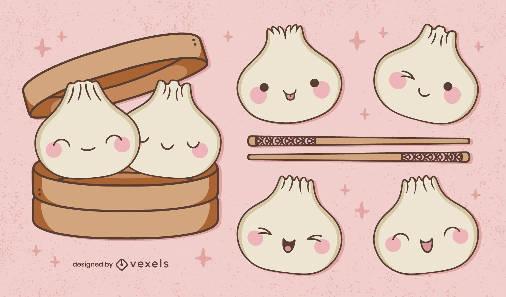

  *Cute Dumplings Illustration from <a href="https://www.vexels.com/vectors/preview/330580/cute-dumplings-illustration?ref=vexelsck">Vexels</a>*

Welcome to Dumplings—where I talk about Natural Language Processing (NLP) in bite-sized blog posts. You might be wondering, "Why call a NLP blog *Dumplings*?" Well, let me explain.

Dumplings are a metaphor for what I aim to do here. These delicious, teeny tiny pockets of goodness are packed with flavor, and love. That's exactly what I envision for this blog—short posts that are full of information. Just a side note: pair the dumplings with chilli oil and Samyang 2x Spicy Ramen[1], you'll turn into a dragon but it will be worth it.

During my Bachelor of Computer Science, my senior year project partner  and I  used to make spicy ramen in a kettle and order chicken and corn dumplings. Once ready, we'd plate everything up in two aluminum boxes, each with three dumplings. It was our little escape from the stress of project deadlines and exams—a simple meal that brought comfort in the midst of chaos. That's the spirit I want to bring to Dumplings, and I hope you'll find these bite-sized pieces of knowledge just as fulfilling.

### References

  [1] <a href="https://thesamyang.pk/collections/all?srsltid=AfmBOookDXAM9PPdc-Nn-29K-4Eg4ailCrGWvlmleUOmMJc2qujNL3cC" target="_blank">Samyang Ramen</a>

